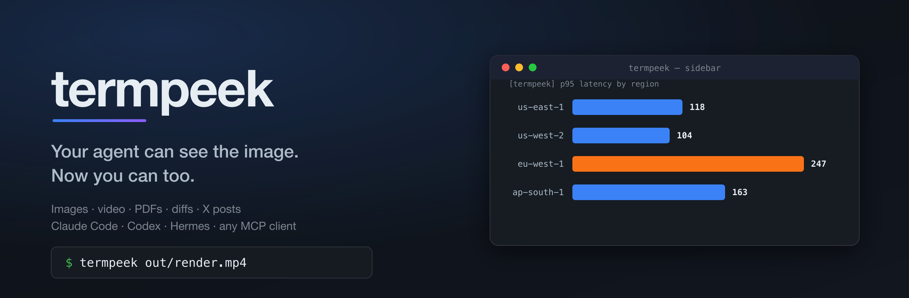

<div align="center">



<h3>Preview images, video, PDFs, code and diffs from inside an AI coding CLI that can't show them to you.</h3>

[](https://github.com/0xNyk/termpeek/actions/workflows/ci.yml)
[](https://github.com/0xNyk/termpeek/releases)
[](LICENSE)
[](#requirements)
[](#requirements)

[Install](#install) · [Usage](#usage) · [Configuration](#configuration) · [How it works](docs/how-it-works.md) · [Contributing](CONTRIBUTING.md)

</div>

---

When your agent writes an image, you get `Read image (42 KB)`. The agent can see
it. You can't — the full-screen TUI sits between every renderer and your screen.

termpeek doesn't fight the TUI. It renders where the TUI never repaints.

```bash
termpeek ~/Desktop/dashboard-v3.png              # image, full pixels
termpeek out/onboarding-demo.mp4                 # video, sampled into a filmstrip
termpeek docs/2026-q3-report.pdf                 # rendered page, not a filename
termpeek https://x.com/nykdotdev/status/20       # the post, as a card
termpeek --diff HEAD~1                           # what changed, side by side
```


## Features

- **Images, video, PDFs, code, diffs and X posts** — one command, type detected
  automatically
- **Works inside the agent** — Claude Code, Codex, Hermes, Gemini, or anything
  that speaks MCP
- **A sidebar, not a context switch** — previews open beside the conversation
  and reuse one tmux pane
- **Automatic previews** — a `PostToolUse` hook shows media the moment the agent
  writes it
- **X posts without an API key** — paste a link, get the rendered card
- **Degrades instead of failing** — no graphics protocol means Unicode block
  art, which works in every terminal and over SSH
- **No runtime to install** — bash 3.2, so it runs on a stock Mac
- **Entirely local** — nothing is sent anywhere

## Install

```bash
git clone https://github.com/0xNyk/termpeek
cd termpeek && ./install.sh
```

Then the renderers (Homebrew shown; all are widely packaged):

```bash
brew install chafa ffmpeg    # required: images, video, PDFs, tiling
brew install poppler         # PDFs (pdftoppm)
brew install bat git-delta   # code and diffs
brew install tmux            # optional, gives the sidebar
```

`chafa` and `ffmpeg` are the two that matter. Everything else degrades.

<details>
<summary>Bootstrap script, and why it isn't the headline instruction</summary>

`get.sh` clones or updates the repo and runs the installer. Fetch it, read it,
then run it — it is deliberately short:

```bash
curl -fsSL https://raw.githubusercontent.com/0xNyk/termpeek/main/get.sh -o get.sh
less get.sh && sh get.sh
```

It clones a public repository and symlinks three scripts into `~/.local/bin`.
Nothing else: no sudo, no shell profile edits, no daemons. Piping an installer
straight into a shell is a habit worth not having.

</details>

### Quick start

```bash
tp-session          # launch claude inside tmux with the sidebar ready
tp-session codex    # or any other agent CLI
```

Then ask the agent to preview anything, or run `termpeek <file>` yourself.

## Usage

```bash
termpeek out/latency-by-region.png       # detect type, pick transport, show it
termpeek --diff                          # working-tree diff
termpeek --diff HEAD~3 -- src/           # any git diff arguments
termpeek --pages docs/2026-q3-report.pdf # contact sheet of every page
termpeek --page 4 docs/spec.pdf          # a specific page
termpeek https://x.com/nykdotdev/status/20
termpeek --gallery shot.png report.pdf   # several items at once
termpeek --carousel --wait 4 img/*.png   # one at a time
termpeek --probe                         # what your terminal actually supports
```

| Flag | Meaning | Default |
|---|---|---|
| `-g, --geometry <WxH>` | size in character cells | measured from the pane |
| `-p, --protocol` | `kitty` \| `iterm` \| `sixel` \| `symbols` | detected |
| `-t, --transport` | `tmux` \| `window` \| `inline` | detected |
| `--page <n>` | PDF page | `1` |
| `--pages` | PDF contact sheet | off |
| `--gallery` | tile several items together | off |
| `--carousel` | cycle several items, one at a time | off |
| `--cols <n>` | gallery columns | auto — whatever fits the pane best |
| `--wait <s>` | carousel delay per item | `3` |
| `--dpi <n>` | PDF DPI (overrides exact-pixel sizing) | auto |
| `--loops <n>` | video loops, `-1` for forever | `1` |
| `--here` | write to stdout, skip the transport | off |

## What it renders

| Type | Renderer | Notes |
|---|---|---|
| Images | chafa | PNG, JPG, GIF, WebP, SVG, AVIF, JXL, TIFF, QOI |
| Video | ffmpeg → chafa | sampled into a filmstrip; `TERMPEEK_ANIMATE=1` to play it |
| PDF | pdftoppm → chafa | rasterized at 2x the display size, framed as a page |
| Tiled views | ffmpeg → chafa | composed into one image, laid out to fit the pane |
| Diffs | delta | syntax highlighted, side-by-side when wide enough |
| Code | bat | syntax highlighting and line numbers |
| X posts | SVG → chafa | avatar, badge, text, counts — no API key needed |

Inside tmux everything goes through chafa, including video and tiled views —
[here's why](docs/how-it-works.md#2-tmux-stores-no-graphics-only-placeholders).

<details>
<summary>See each type rendered</summary>

Every image below is generated from real command output by `tools/ansi2svg.py`,
not drawn by hand.

### Images


### Video


A clip is sampled into a filmstrip by default, because a still persists in the
pane and an animation does not. `TERMPEEK_ANIMATE=1` plays it instead.

### PDFs


Rasterized at twice the pixel size the terminal will draw, then downscaled, so
the downscale itself does the anti-aliasing and small type stays legible.

`--pages` gives the whole document at once:


### Diffs


### Code


### Several things at once

```bash
termpeek --gallery a.png report.pdf https://x.com/nykdotdev/status/20
termpeek --carousel --wait 4 links/*.url     # one at a time
```


The layout adapts to the pane rather than assuming a row: a narrow sidebar
stacks the tiles, a wide window spreads them. Pin it with `--cols`.

### The sidebar


Captured from a real tmux session: the agent runs on the left, previews open on
the right and reuse that one pane.

### Capability probe


</details>

## Integrations

| CLI | How | Status |
|---|---|---|
| Claude Code | skill, auto-preview hook, or MCP | verified end to end |
| Codex | MCP | verified end to end — `mcp: termpeek/preview (completed)` |
| Hermes Agent | MCP | connected, all 4 tools discovered by its own tester |
| Gemini CLI | MCP | protocol verified, not tried in the client |
| Grok Build | renders images natively; termpeek adds PDFs, diffs and posts | untested |

Gemini is protocol-verified only; it is marked that way rather than assumed.
If your agent can run a shell command or speak MCP, it can use termpeek.

### MCP

```bash
claude mcp add termpeek -- /path/to/termpeek/scripts/termpeek-mcp
codex mcp add termpeek  -- /path/to/termpeek/scripts/termpeek-mcp
hermes mcp add termpeek --command /path/to/termpeek/scripts/termpeek-mcp
```

Four tools: `preview`, `preview_many`, `preview_diff`, `probe`.

This differs from other image-related MCP servers in a way worth stating: they
return base64 so the **model** can see a picture. This renders to **your
terminal** and returns text to the model. The model already has a tool for
reading an image; what it cannot do is put one in front of you. See
[hooks/mcp/README.md](hooks/mcp/README.md).

### Automatic previews

A `PostToolUse` hook previews media the moment the agent writes it.

```json
{ "hooks": { "PostToolUse": [ { "matcher": "Write|Edit|NotebookEdit",
  "hooks": [ { "type": "command",
    "command": "/path/to/termpeek/hooks/claude-code/auto-preview.sh" } ] } ] } }
```

Images, PDFs and video only — code and diffs are skipped, because the agent
already shows you those. Repeats of the same file are suppressed for 20 seconds,
so a render loop opens one preview rather than forty. `TERMPEEK_AUTO_PREVIEW=0`
turns it off. See [hooks/claude-code/README.md](hooks/claude-code/README.md).

## Configuration

Everything is an environment variable; none are required.

| Variable | Does | Default |
|---|---|---|
| `TERMPEEK_PROTOCOL` | force `kitty` / `iterm` / `sixel` / `symbols` | detected |
| `TERMPEEK_TRANSPORT` | force `tmux` / `window` / `inline` / `none` | detected |
| `TERMPEEK_GEOMETRY` | size in cells, e.g. `80x40` | measured from the pane |
| `TERMPEEK_ANIMATE` | `1` plays video instead of a filmstrip | `0` |
| `TERMPEEK_STRIP_FRAMES` | frames sampled for the filmstrip | `4` |
| `TERMPEEK_SUPERSAMPLE` | PDF raster multiple | `2` |
| `TERMPEEK_MAX_PAYLOAD` | bytes before a render is scaled down | `8000000` |
| `TERMPEEK_RENDERER` | `timg` to prefer timg outside tmux | chafa |
| `TERMPEEK_COLS` | pin gallery columns | auto |
| `TERMPEEK_SIDEBAR_WIDTH` | sidebar pane width | `45%` |
| `TERMPEEK_TMUX_MODE` | `sidebar` or `popup` | `sidebar` |
| `TERMPEEK_WINDOW_APP` | terminal to spawn for the window transport | platform default |
| `TERMPEEK_X_BACKEND` | `syndication` / `xint` / `cookies` | tried in order |
| `TERMPEEK_X_COOKIE_FILE` | cookie file for the cookie backend | unset |
| `TERMPEEK_AUTO_PREVIEW` | `0` disables the hook | `1` |
| `TERMPEEK_CACHE_DISABLE` | `1` bypasses the cache | `0` |

## Documentation

- [How it works](docs/how-it-works.md) — the TUI problem, transports, and the
  three constraints the implementation is built around
- [X post previews](docs/x-posts.md) — backends, cookie auth, limitations
- [Caching](docs/caching.md) — what is cached, and how it is invalidated
- [Contributing](CONTRIBUTING.md) · [Security](SECURITY.md) · [Changelog](CHANGELOG.md)

## Comparison

There are good pieces in this space. None of them cover the whole problem.

| | Covers | Gap termpeek fills |
|---|---|---|
| chafa / timg / viu | rendering | no way past the agent's TUI; auto-detection downgrades silently |
| Existing Claude Code image skills | images, Claude only | no video, PDFs or diffs; single-agent |
| MCP image servers | the *model* sees the image | you still don't; different problem, both useful |
| cterm, cmux, Warp | replacing your terminal | termpeek works with the terminal you already use |
| Grok Build's native support | images, one vendor | everything else, plus PDFs and diffs |

## FAQ

**Does it send anything anywhere?** No. Rendering is entirely local.

**What if my terminal has no graphics support?** You get Unicode block art. It
works in every terminal, including over SSH and inside CI logs.

**Do I have to use tmux?** No. Without it you get a separate window, which works
everywhere. tmux only buys you the sidebar.

**Why doesn't my video move?** By design — the default is a filmstrip, because a
still survives in the pane and an animation does not. `TERMPEEK_ANIMATE=1` plays
it.

**A large preview came up empty.** Lower `TERMPEEK_MAX_PAYLOAD`. chafa transmits
uncompressed RGBA, and tmux discards output once a pane's backlog gets large
enough.

**Will this break when Claude Code adds native image support?** Images become
redundant; video, PDFs, diffs and the other agents do not. The tool is built
around a constraint that only partly goes away.

**Does it work over SSH?** Yes, with the caveats you'd expect: Kitty graphics
pass through, and the block-art fallback always works.

## Requirements

macOS or Linux. `bash` 3.2 is enough (macOS ships it). `chafa` and `ffmpeg` are
the dependencies that matter — ffmpeg composes tiled views, samples video
filmstrips and frames PDF pages. `poppler` (`pdftoppm`) is needed for PDFs,
`bat` and `git-delta` for code and diffs.

On Linux you need either tmux or a terminal emulator and a display; headless
hosts get the inline path only.

## Contributing

```bash
./tests/run.sh
```

Contributions welcome — see [CONTRIBUTING.md](CONTRIBUTING.md). The most useful
thing you can add is a regression test: every bug in this project failed
*silently*, by falling back rather than erroring.

CI runs shellcheck plus the suite on Ubuntu and macOS. macOS gets its own job
because it ships bash 3.2, where an empty array under `set -u` is fatal — a
difference that has already broken this project once.

## License

[MIT](LICENSE) © [0xNyk](https://github.com/0xNyk)
