# termpeek

Preview images, video, PDFs, code and diffs from inside an AI coding CLI that
can't show them to you.

Claude Code, Codex, Gemini CLI and Hermes all run a full-screen TUI that owns
the terminal. When a tool writes an image, you get `Read image (42 KB)`. The
agent can see it. You can't.

termpeek doesn't fight the TUI. It renders where the TUI never repaints.

```bash
termpeek ~/Desktop/dashboard-v3.png              # image, full pixels
termpeek out/onboarding-demo.mp4                 # video, actual motion
termpeek docs/2026-q3-report.pdf                 # rendered page, not a filename
termpeek https://x.com/nykdotdev/status/20       # the post, as a card
termpeek --diff HEAD~1                           # what changed, side by side
```

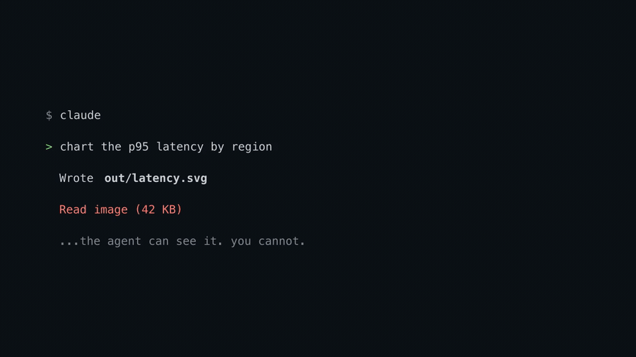

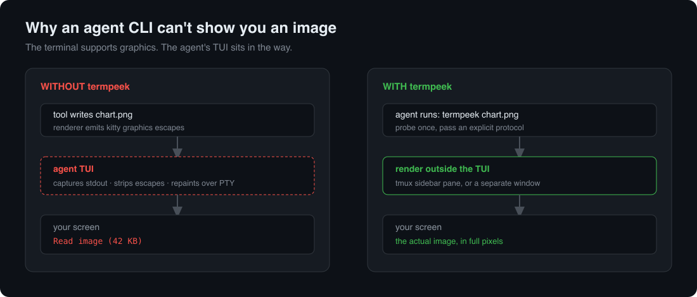

## Why this is needed

Terminal graphics protocols have existed for years. The blocker isn't the
terminal, it's the agent's TUI sitting between your renderer and the screen.

Measured from inside a Claude Code tool call:

| Approach | Result |
|---|---|
| Model emits escape sequences | sanitized before display |
| Subprocess writes to stdout | captured as text |
| Write to `/dev/tty` | `device not configured` |
| Write to the PTY directly | overwritten on next repaint |

Only one agent CLI renders media natively today: **Grok Build**, which added
Kitty graphics in v0.1.212 (June 2026). Claude Code has six open or duplicated
issues requesting it. Codex has one. termpeek covers the rest, and adds video,
PDFs and diffs on top.

## Install

```bash
git clone https://github.com/0xNyk/termpeek
cd termpeek && ./install.sh
```

There is also a bootstrap script, `get.sh`, which clones or updates the repo and
runs the installer. Fetch it, read it, then run it — it is deliberately short:

```bash
curl -fsSL https://raw.githubusercontent.com/0xNyk/termpeek/main/get.sh -o get.sh
less get.sh && sh get.sh
```

It clones a public repository and symlinks three scripts into `~/.local/bin`.
Nothing else: no sudo, no shell profile edits, no daemons. Piping an installer
straight into a shell is a habit worth not having, so it is not the headline
instruction here.

Renderers (Homebrew shown; all are widely packaged):

```bash
brew install chafa timg      # images and video (timg pulls in poppler for PDFs)
brew install bat git-delta   # code and diffs
brew install tmux            # optional, gives the best transport
```

## Usage

```bash
termpeek out/latency-by-region.png       # detect type, pick transport, show it
termpeek --diff                          # working-tree diff
termpeek --diff HEAD~3 -- src/           # any git diff arguments
termpeek --pages docs/2026-q3-report.pdf # contact sheet of every page
termpeek --page 4 docs/spec.pdf          # a specific page
termpeek https://x.com/nykdotdev/status/20
termpeek --gallery shot.png report.pdf   # several items at once
termpeek --carousel --wait 4 img/*.png   # one at a time
termpeek --probe                         # what your terminal actually supports
```

| Flag | Meaning | Default |
|---|---|---|
| `-g, --geometry <WxH>` | size in character cells | `80x40` |
| `-p, --protocol` | `kitty` \| `iterm` \| `sixel` \| `symbols` | detected |
| `-t, --transport` | `tmux` \| `window` \| `inline` | detected |
| `--page <n>` | PDF page | `1` |
| `--pages` | PDF contact sheet | off |
| `--gallery` | tile several items together | off |
| `--carousel` | cycle several items, one at a time | off |
| `--cols <n>` | gallery columns | one row, max 4 |
| `--wait <s>` | carousel delay per item | `3` |
| `--dpi <n>` | PDF DPI (overrides exact-pixel sizing) | auto |
| `--loops <n>` | video loops, `-1` for forever | `1` |
| `--here` | write to stdout, skip the transport | off |

## What it renders

| Type | Renderer | Notes |
|---|---|---|
| Images | chafa | PNG, JPG, GIF, WebP, SVG, AVIF, JXL, TIFF, QOI |
| Video | timg | full-pixel Kitty graphics, compressed |
| PDF | pdftoppm → chafa | rasterized at exact display size, framed as a page |
| Diffs | delta | syntax highlighted, side-by-side when wide enough |
| Code | bat | syntax highlighting and line numbers |
| X posts | SVG → chafa | avatar, badge, text, counts — no API key needed |

Every image below is generated from real command output by `tools/ansi2svg.py`,
not drawn by hand — see [Demos are reproducible](#demos-are-reproducible).

### Images

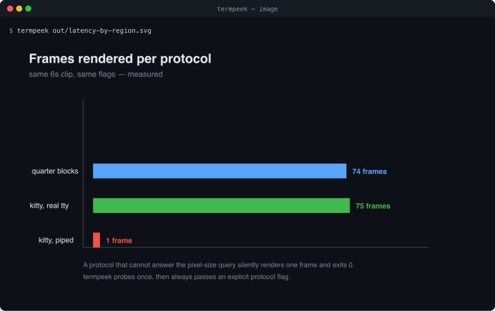

### Video

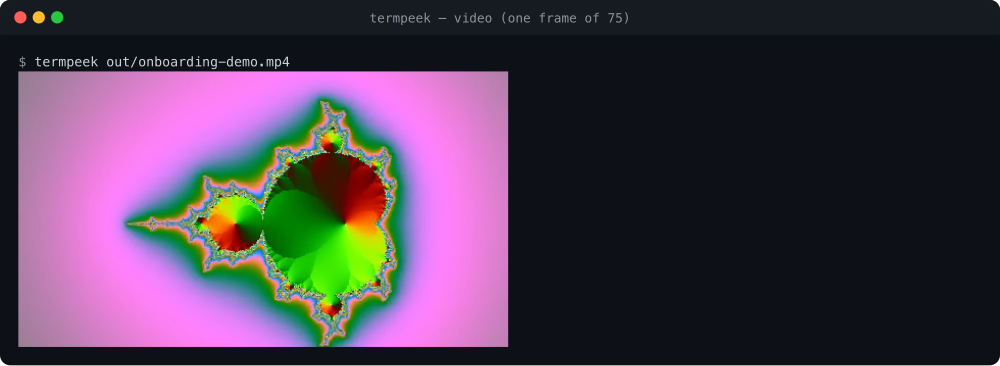

Plays at full frame rate under Kitty graphics — 75 frames at 15.1fps on the clip
above. A single frame is shown here because a README cannot move.

### PDFs

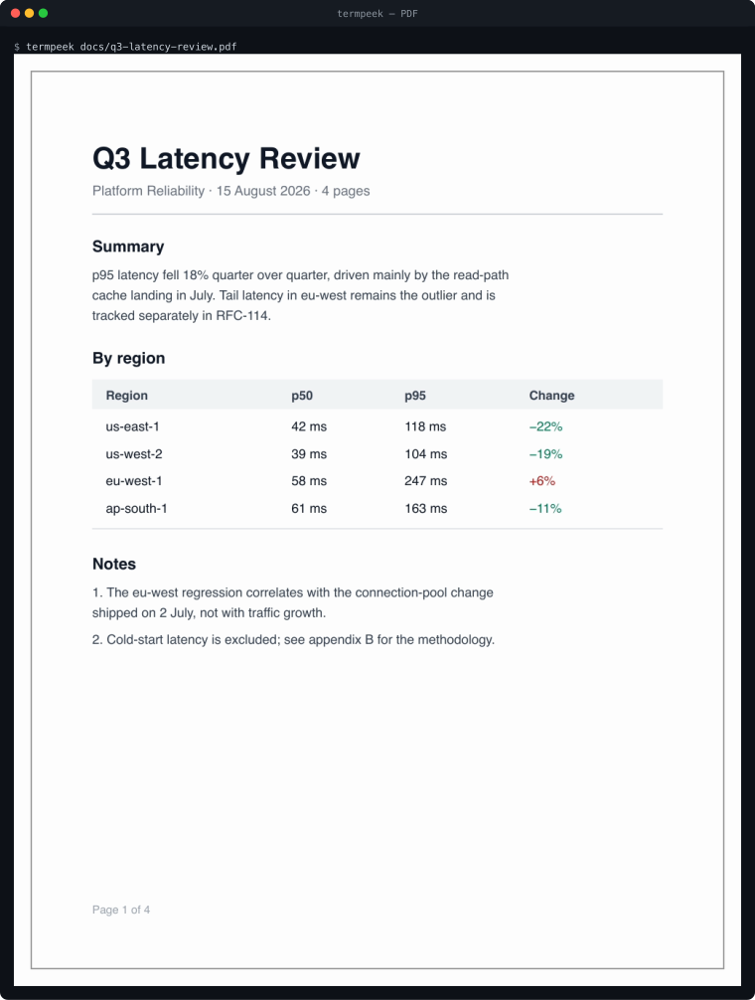

Rasterized at exactly the pixel size the terminal will draw, so the type stays
legible instead of going through two lossy resizes.

`--pages` gives the whole document at once:

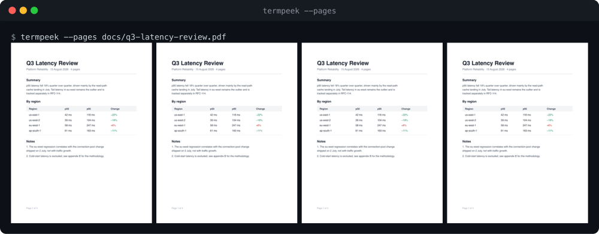

### Diffs

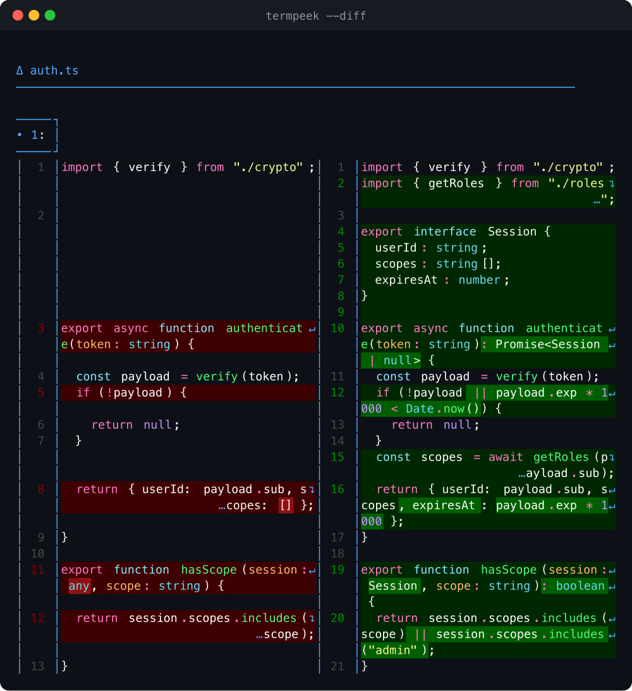

### Code

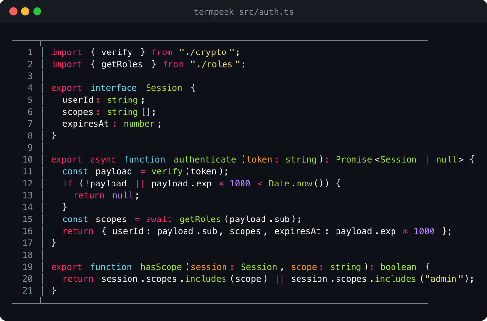

### Several things at once

Pass more than one target and they are shown together — mix types freely:

```bash
termpeek --gallery a.png report.pdf https://x.com/nykdotdev/status/20
termpeek --carousel --wait 4 links/*.url     # one at a time
```

Tiling needs `timg`. A carousel does not — it falls back to chafa alone, which
matters on Linux, where `timg` is rarely packaged.

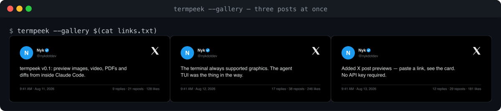

### The sidebar

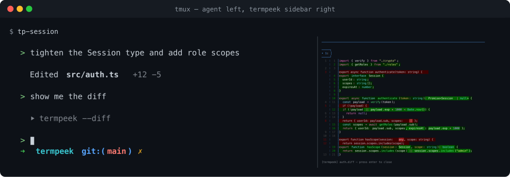

Captured from a real tmux session: the agent runs on the left, previews open on
the right and reuse that one pane.

### Capability probe

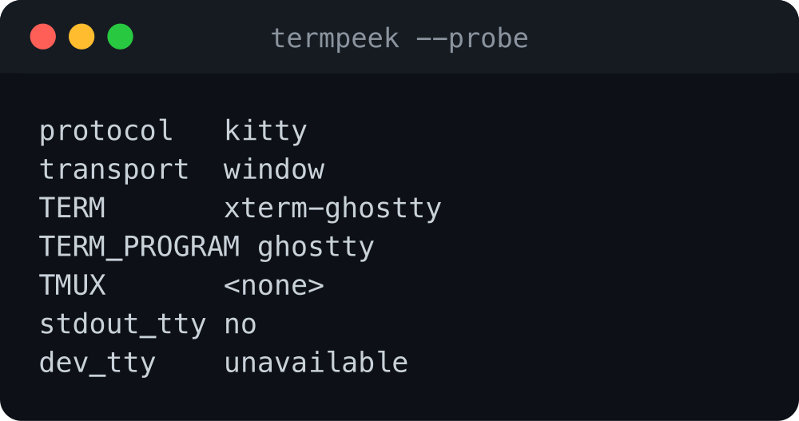

## X posts

Paste a link, see the post. No API key, no browser, no login.

```bash
termpeek https://x.com/nykdotdev/status/20
```

The card is generated as SVG and handed straight to chafa, which rasterizes SVG
natively — so this path adds no browser, no headless Chrome, and no JavaScript
toolchain.

Three ways to fetch, tried in order:

| Backend | Needs | Use when |
|---|---|---|
| `syndication` | nothing | default — the endpoint behind embedded posts |
| `xint` | an X API key | you already run [xint](https://github.com/0xNyk/xint) and want the official API |
| `cookies` | a logged-in session | posts the first two can't reach |

Pin one with `TERMPEEK_X_BACKEND=xint`.

For the cookie backend, put `auth_token` and `ct0` in a file and point at it:

```bash
chmod 600 ~/.config/termpeek/x-cookies
export TERMPEEK_X_COOKIE_FILE=~/.config/termpeek/x-cookies
```

Cookies are session credentials. termpeek reads the file straight into a request
header — never echoes it, never logs it, and never puts it on a command line
where it would appear in the process list. It warns if the file is readable by
anyone but you.

The syndication endpoint is undocumented and can change without notice. That is
the trade for needing no setup; the other two backends exist for when it does.

## Transports

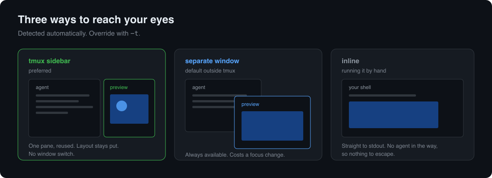

Chosen automatically; override with `-t`.

**tmux** — a sidebar pane next to the agent, for text: diffs and code. Previews
reuse one pane, so the layout stays put no matter how many you open.

Images do NOT go here, and cannot. tmux keeps no graphics in its screen buffer:
`allow-passthrough` forwards the bytes, but the picture is not part of the
pane's contents, so the first redraw erases it — and a pane that has just
appeared redraws immediately. Text survives because text *is* the buffer.
Pixel previews are therefore routed to a window that owns its own screen, even
inside tmux. Override with `TERMPEEK_TMUX_PIXELS=1` if your setup disagrees.

**window** — a separate terminal window. Always works, costs a focus change.
This is the default when you're not in tmux.

**inline** — straight to stdout, for running termpeek by hand.

On Linux the window transport spawns your terminal emulator — `$TERMINAL` if you
set one, otherwise the first of kitty, wezterm, ghostty, foot, konsole,
alacritty, gnome-terminal, xterm that is installed. With no display server
attached there is nowhere to put a window, so the transport reports `none`
rather than spawning something you will never see; use tmux there.

To make the sidebar the default, launch your agent through the wrapper:

```bash
tp-session            # claude, inside tmux, sidebar ready
tp-session codex      # or any other agent CLI
```

It records your terminal's graphics protocol before tmux rewrites `TERM`, and
enables `allow-passthrough` — without which tmux eats the escape sequences that
carry Kitty graphics.

## Previews that open by themselves

A `PostToolUse` hook previews media the moment the agent writes it, so you stop
having to ask.

```json
{ "hooks": { "PostToolUse": [ { "matcher": "Write|Edit|NotebookEdit",
  "hooks": [ { "type": "command",
    "command": "/path/to/termpeek/hooks/claude-code/auto-preview.sh" } ] } ] } }
```

Images, PDFs and video only — code and diffs are skipped, because the agent
already shows you those and a window per edit would be intolerable. Repeats of
the same file are suppressed for 20 seconds, so a render loop opens one preview
rather than forty. Set `TERMPEEK_AUTO_PREVIEW=0` to turn it off without editing
settings. Full notes in [hooks/claude-code/README.md](hooks/claude-code/README.md).

## Any agent that speaks MCP

Codex, Gemini CLI and the rest have no plugin surface worth targeting one at a
time, but they all speak MCP.

```bash
claude mcp add termpeek -- /path/to/termpeek/scripts/termpeek-mcp
```

```json
{ "mcpServers": { "termpeek": { "command": "/path/to/termpeek/scripts/termpeek-mcp" } } }
```

Four tools: `preview`, `preview_many`, `preview_diff`, `probe`.

Worth being clear about how this differs from other image-related MCP servers:
they return base64 so the **model** can see a picture. This renders to **your
terminal** and returns text to the model. The model already has a tool for
reading an image; what it cannot do is put one in front of you. Details in
[hooks/mcp/README.md](hooks/mcp/README.md).

## Caching

Expensive work is cached; cheap work is not.

| Path | Cold | Warm |
|---|---|---|
| X post card | 1441 ms | 186 ms |
| PDF page | 476 ms | 119 ms |
| image | ~90 ms | not cached |
| diff | ~100 ms | not cached |

Those are measured, not estimated. A cache that saves 90 ms is not worth the
risk of showing you something stale, so images and diffs go straight through.

Invalidation differs by input, because the inputs do:

**Local files** are keyed on path, size and mtime. Editing a PDF changes the
key, so there is no TTL and no way to be served a stale page.

**Remote data** is keyed on the post id with a TTL, since there is nothing local
to compare against. Post records expire after 15 minutes — the text never
changes but the counts do. Avatars last a week. Caching the fetch also blunts
the project's flakiest dependency: an undocumented endpoint that can rate-limit
or disappear.

```bash
termpeek --cache          # what is cached
termpeek --clear-cache    # empty it
termpeek --no-cache FILE  # re-render this once
```

## Two traps worth knowing

Both cost real debugging time. They're encoded in the code; don't undo them.

**Renderers lie when stdout isn't a terminal.** chafa and timg both downgrade to
character art rather than failing. timg is worse: with no answer to its pixel
size query it renders a *single frame* of a video, exits `0`, and mentions it
only on stderr. Same clip, same flags: piped gave 1 frame, a real terminal gave
75 at 15.1fps. So termpeek probes once and always passes an explicit protocol.

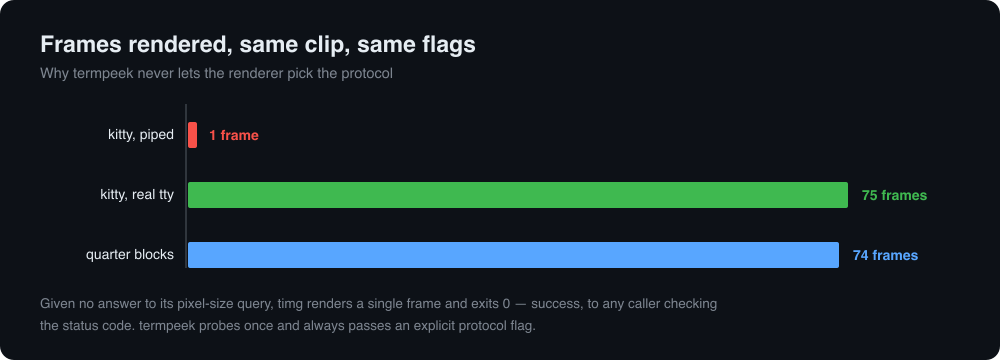

**A frozen frame is worse than coarse pixels.** When stdout genuinely isn't a
terminal, video falls back to block rendering on purpose. Moving and coarse
beats sharp and stuck.

## Supported agents

| CLI | How | Status |
|---|---|---|
| Claude Code | skill, auto-preview hook, or MCP | verified end to end |
| Codex | MCP | verified end to end — `mcp: termpeek/preview (completed)` |
| Hermes Agent | MCP | connected, all 4 tools discovered by its own tester |
| Gemini CLI | MCP | protocol verified, not tried in the client |
| Grok Build | renders images natively; termpeek adds PDFs, diffs and posts | untested |

Claude Code and Codex have been driven end to end — Codex discovers the tools,
calls `preview`, and the window opens. Hermes connects and enumerates all four
tools via `hermes mcp test`. Gemini is protocol-verified only; I have not run it
from that client, so it is marked accordingly rather than assumed.

If your agent can run a shell command or speak MCP, it can use termpeek.

```bash
claude mcp add termpeek -- /path/to/termpeek/scripts/termpeek-mcp
codex mcp add termpeek  -- /path/to/termpeek/scripts/termpeek-mcp
hermes mcp add termpeek --command /path/to/termpeek/scripts/termpeek-mcp
```

## How this differs from what already exists

There are good pieces in this space. None of them cover the whole problem.

| | Covers | Gap termpeek fills |
|---|---|---|
| chafa / timg / viu | rendering | no way past the agent's TUI; auto-detection downgrades silently |
| Existing Claude Code image skills | images, Claude only | no video, PDFs or diffs; single-agent |
| MCP image servers | the *model* sees the image | you still don't; different problem, both useful |
| cterm, cmux, Warp | replacing your terminal | termpeek works with the terminal you already use |
| Grok Build's native support | images, one vendor | everything else, plus PDFs and diffs |

## Questions

**Does it send anything anywhere?** No. Rendering is entirely local.

**What if my terminal has no graphics support?** You get Unicode block art. It
works in every terminal, including over SSH and inside CI logs.

**Do I have to use tmux?** No. Without it you get a separate window, which works
everywhere. tmux only buys you the sidebar.

**Will this break when Claude Code adds native image support?** Images become
redundant; video, PDFs, diffs and the other agents do not. The tool is built
around a constraint that only partly goes away.

**Why shell instead of a real language?** No runtime to install, and it targets
bash 3.2 so it runs on a stock Mac. The whole thing is under 1,100 lines.

**Does it work over SSH?** Yes, with the caveats you'd expect: Kitty graphics
pass through, and the block-art fallback always works.

## Requirements

macOS or Linux. On Linux you need either tmux or a terminal emulator and a
display; headless hosts get the inline path only. `bash` 3.2 is enough (macOS
ships it). `ffmpeg` is used for PDF
page framing. Everything else degrades: with no graphics protocol you get
Unicode block art, which works in any terminal.

## Demos are reproducible

The video too. `tools/make-demo-video.sh` builds `demo.mp4` from real output,
and `tools/record-session.sh` records an actual tmux session by sampling its
panes — the sidebar in that clip really opens.

Neither uses screen recording. macOS records a whole display, so if the window
you meant to capture never comes to the front, the recording quietly contains
whatever else was on screen. That is not hypothetical: it happened while
building this README, and the capture held someone's unrelated work. Sampling a
pane cannot do that.


Every demo above comes from real command output. `tools/ansi2svg.py` reads the
bytes a command actually writes — SGR colour, bold, dim, inverse — and draws
them as SVG. The tmux sidebar is a genuine `tmux capture-pane`.

They are not screenshots, deliberately. Capturing a terminal captures whatever
else is on screen, and produces a bitmap nobody can diff or regenerate. This way
the demos rebuild from source and contain nothing but the command's own output.

```bash
./scripts/termpeek --here --diff | tools/ansi2svg.py --title "termpeek --diff" -o out.svg
```

## Testing

```bash
./tests/run.sh
```

The suite checks renderer selection and escape-sequence structure, including a
regression guard against the frozen-video bug. Whether pixels *look* right needs
a human at a real terminal; that part can't be asserted from inside an agent.

## License

MIT
